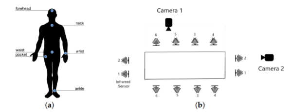
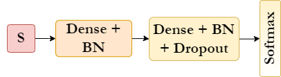
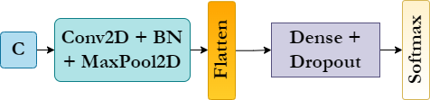
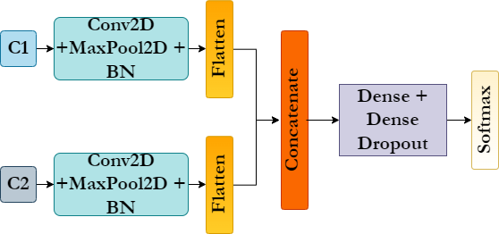
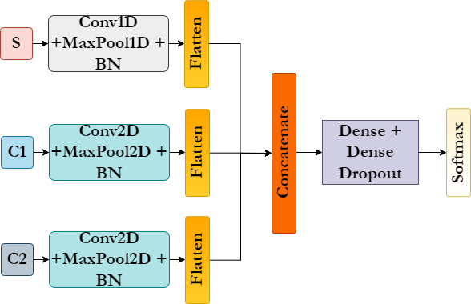

# Fall Detection using multimodal data

In this repository, you'll be able to find the python programs written in Jupyter Notebook used for the **Fall Detection using multimodal data**. 
load_data.py file shows how we download and form sensor and camera datasets. 
model.py file demonstrates our proposed models and compares with [UP's models](https://www.mdpi.com/1424-8220/19/9/1988).

## Acknowledgements
- This project was also a part of my Seminar subject at university.
- This project was inspired by 2 of my teachers at HCMUS: Thao. V Ha and Binh Nguyen et. al
- My main responsibilities in this project were implementing code, visualization, and writing a paper.
- Our teacher helped me correct my writing mistakes and submitted the paper.

## Project Status
Project is:  _complete_. And accepted to present at [MMM 2022 Conference](https://mmm2022.org/).

[**Springer Link**](https://link.springer.com/chapter/10.1007/978-3-030-98358-1_31#citeas)

[**PDF**](https://github.com/hoangNguyen210/Fall-Detection-Research-1/blob/main/paper.pdf)

## System requirement 
- numpy - version 1.21.5
- pandas - version 1.3.5
- cv2 -version 4.1.2
- sklearn -version 1.0.2
- tensorflow - version 2.8.0
- keras - version 2.8.0

**Here is the short form of our paper.** (I changed the pictures of some models for my presentation at Seminar)
## Table of Contents
<!-- * [Acknowledgements](#acknowledgements) -->
* [Introduction](#introduction)
* [General Info](#general-information)
* [Dataset description](#dataset-description)
* [Data preprocessing](#d-p)
* [Proposed method](#proposed-method)
* [Result](#result)
* [Conclusion and Furture Work](#cc)
* [Room for Improvement](#room-for-improvement)
* [Contact](#contact)

## Introduction
> Falling is one of the most common dangers that the elderly usually face during their daily lives, and the potential of death after falling might increase if they live alone.  As reported by the Center for Diseases and Controls [CDC](https://www.cdc.gov/homeandrecreationalsafety/falls/adultfalls.html), the percentage of death after falling in the U.S went up 30% from 2007 to 2016 for older adults. In case we do not find an appropriate way to stop these rates keep growing, there may be approximately seven deaths per hour by 2030.

## General Information
- Understanding the fearful outcomes that falling leads to, developing a fall
detection system is essential than ever before.
- We going to use [UP-Fall Detection](https://www.mdpi.com/1424-8220/19/9/1988) in this project and utilize both machine learning and deep learning on this data.
- Enable to detect a precise fall detection system might significantly mitigate the risk of falling in the ederly
- 

## Dataset description
- You can download UP-Fall Detection dataset in this [link](https://sites.google.com/up.edu.mx/har-up/) . This dataset includes over 850 GB of data from wearable sensors, ambient sensors, and vision equipment. 17 young healthy people with age ranging from 18–24 years old were invited to perform 11 different activities. Here is the summary of activities. 

| Activity ID | Description  | Duration (s)  |
| :-----:     | :-:          | :-:           |
|     1        | Falling forward using hands          | 10           |
| 2     | Falling forward using knees          | 10           |
| 3    | Falling backwards         | 10           |
| 4     | Falling sideward          | 10           |
| 5     | Falling sitting in empty chair         | 10           |
| 6     | Walking          | 60           |
| 7     | Standing         | 60           |
| 8     | Sitting          | 60           |
| 9     | Picking up an object         | 10           |
| 10     | Jumping          | 30           |
| 11     | Laying          | 60           |

||
|:--:| 
| *Location of measurement devices* |
<!-- If you have screenshots you'd like to share, include them here. -->
You can read more about this dataset at this [paper](https://www.mdpi.com/1424-8220/19/9/1988).

## Data preprocessing :
- Related to the sensor data, we dropped all duplicate records and removed rows and columns having missing values. We also utilized the index of sensor data to query to vision-based dataset to gurantee 2 kind of datasets have same samples, this step is significant to combine these datasets in when compiling the models.
- In addition, we also applied Standard Scaler and scaling each by divide 255 to warrant our dataset in small range. 

## Proposed methods :
- In term of sensor dataset, we proposed 2 machine learning algorithm that win a lot of Kaggle competitions : [XGBoost](https://xgboost.readthedocs.io/en/stable/), [CatBoost](https://catboost.ai/) and 1 deep learning technique : MLP. Here is some hyperparameters we choose for these algorithms : 

| Models | Hyperparameters  | 
| :-----:     | :-:          |
|     XGBoost        | objective="multi:softprob",   learning rate = 0.5,   random state = 42,    use label encoder = False,   # of estimators = 100  |
| CatBoost     | # of estimators = 500,    random seed = 42,   learning rate = 0.25,         max depth = 12         | 

||
|:--:| 
| *MLP model for sensor data* |

- With camera based dataset, we take advantages of CNN2D. 

||
|:--:| 
| *CNN2D model for camera data* |

- Concatenating both kind of data :

||
|:--:| 
| *Concatenaing CNN2D Model for Camera 1 and Camera 2* |

||
|:--:| 
| *Combining Sensor , Camera 1 and Camera 2* |

## Result 
<!-- | Data | Model  | Accuracy  | Precision | Recall | F1-Score |
|---------------|-----------|-----------|--------|----------|
| S | XGBoost   CatBoost   MLP  |  | 99.21   99.05   99.04   | 99.19   99.02   99.05   | 99.21   99.05   99.03  | 99.20   99.02   99.03   | -->

- Performance of our proposed method for each dataset :

| Data | Model  | Accuracy  | Precision | Recall | F1-Score |
| :-----:     | :-:          | :-:           |  :-:           |  :-:           |  :-:           |
|     **S**        | XGBoost   CatBoost   MLP   | 99.21   99.05      99.04       | 99.19   99.02    99.05           | 99.21   99.05   99.03   |99.20   99.02   99.03   |
| **C1** | CNN | 99.17  | 99.24 | 99.12 | 99.16 |
| **C2** | CNN | 99.39  | 99.40 | 99.39 | 99.40 |

- Comparing with performance using Martinez's model :

| Data | Model  | Accuracy  | Precision | Recall | F1-Score |
| :-----:     | :-:          | :-:           |  :-:           |  :-:           |  :-:           |
|     **S**        | RF   SVM   KNN   MLP | 97.46   96.96      97.24   90.21       | 97.29   96.82    97.07   98.36   | 98.46   96.96   97.24   90.21 | 97.28   96.61   97.05   88.43   |
| **C1** | CNN | 78.92 | 84.8 | 70.97 | 76.69 |
| **C2** | CNN | 88.24  | 90.32 | 86.13 | 86.96 |

- Combining dataset:

| Data | Model  | Accuracy  | Precision | Recall | F1-Score |
| :-----:     | :-:          | :-:           |  :-:           |  :-:           |  :-:           |
| **C1 + C2** | Combination | 99.47 | 99.46 | 99.47 | 99.46 |
| **C2** | Combination | 99.56  | 99.56 | 99.56 |99.55 |

## Conclusion and Future Work 
There are some things that I need to do with this project in the future
Room for improvement:
- Solved the imbalanced issues in our dataset
- Using more comprehensive architecture in an attempt to acquire higher performance

To do:
- Using the data augmentation method on minority classes
- Utilizing a Mixture of Experts and a 3D-CNN model (in progress)

## Contact
Created by [hoangng210a@gmail.com] - feel free to contact me!

<!-- Optional -->
<!-- ## License -->
<!-- This project is open source and available under the [... License](). -->

<!-- You don't have to include all sections - just the one's relevant to your project -->

